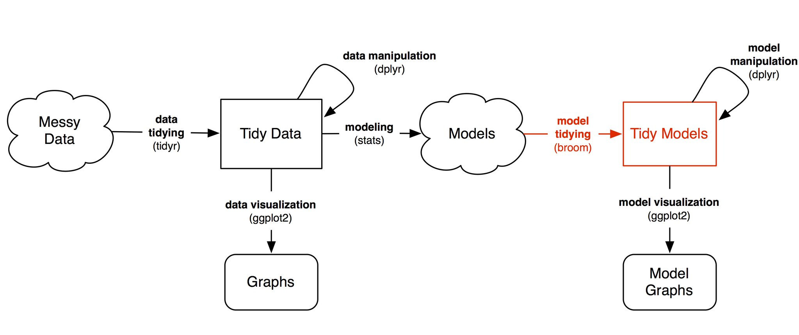

## My Topics for UseR16

- [Outline Motivation](https://github.com/Japhilko/UseR16/blob/master/slides/A_Intro.Rmd)
- [The Openstreetmap project](https://github.com/Japhilko/UseR16/blob/master/slides/B_Openstreetmap.md)
- [The R-package osmar](https://github.com/Japhilko/UseR16/blob/master/slides/C_osmar_example.md)
- The R-package geosmdata
- Conclusion

- [Complete slides](https://github.com/Japhilko/UseR16/blob/master/slides/Kolb_user16.pdf) of my presentation

## [Tutorials](http://blog.revolutionanalytics.com/2016/06/the-user-2016-tutorials.html) at UseR16

- [Data Science at Microsoft](https://azure.microsoft.com/en-us/documentation/articles/machine-learning-data-science-provision-vm/)

- [Using github](http://user2016.org/tutorials/01.html)- [happy git](http://happygitwithr.com/workshops.html#user-2016-stanford)

- [More than words](http://algo.scu.edu/~sanjivdas/Temp/user2016/)

- [Text Mining](http://algo.scu.edu/~sanjivdas/Temp/user2016/)

- [Regression Modelling Strategies](http://biostat.mc.vanderbilt.edu/wiki/Main/RmS)

# Tuesday Presentations at UseR16

[A future for R](http://www.r-bloggers.com/a-future-for-r-slides-from-user-2016/)



[Source](http://varianceexplained.org/files/DavidRobinsonBroomUseR2016.pdf)

- [Package dplyr](https://blog.rstudio.org/2016/06/27/dplyr-0-5-0/)


## Wednesday Presentations

- [R at Microsoft](https://channel9.msdn.com/Events/useR-international-R-User-conference/useR2016/Changing-lives-with-Data-Science-at-Microsoft)

- [shinyjs](http://deanattali.com/shinyjs-user-2016/) - [longer version](http://deanattali.com/shinyjs-shinydevcon-2016/)

## Using Spark with R

- [Jeff Allen](https://twitter.com/trestlejeff) - Using [Apache Spark](http://spark.apache.org/) with Shiny and RMarkdown
- [sparklyr](http://spark.rstudio.com/extensions.html)
- [sparklyr on github](https://github.com/rstudio/sparklyr)


```{r,eval=F}
install.packages("devtools")
devtools::install_github("rstudio/sparklyr")
# spark_install()
# sc <- spark_connect
# spark_read_csv

library(sparklyr)
spark_install(version = "1.6.1")
```


## Catching Up with Rstudio

- [Using Parameters](http://rmarkdown.rstudio.com/developer_parameterized_reports.html)

## Add On 

- Technical Challenges
- [Resources for programming with R](http://www.r-bloggers.com/my-main-resources-for-r-programming/)
- [Possibility to publish](http://f1000research.com/)
