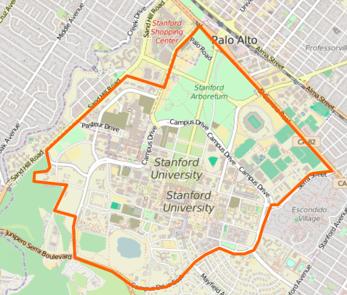
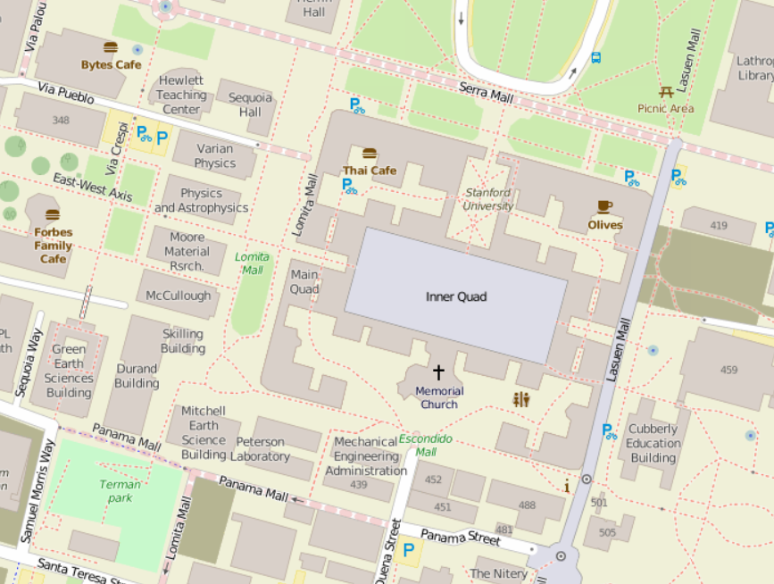

```{r setup, include=FALSE}
knitr::opts_chunk$set(echo = TRUE)
```

## GESIS 

Leibniz Institute for the Social Sciences

- [Research:](http://www.gesis.org/en/services/research/) Information on data, literature, research projects, important institutions and conferences
- [Study planning:](http://www.gesis.org/en/services/study-planning/) Consultation and services for planning and conducting a survey
- [Data collection:](http://www.gesis.org/en/services/data-collection/) Consultation and services during the data collection phase
- [Data analysis:](http://www.gesis.org/en/services/data-analysis/) Support, consultation  and data for secondary analysis and reference, analyzing tools 
- [Archiving and registering:](http://www.gesis.org/en/services/archiving-and-registering/) Longterm permanent archiving and registration of data and publications

## Openstreetmap





