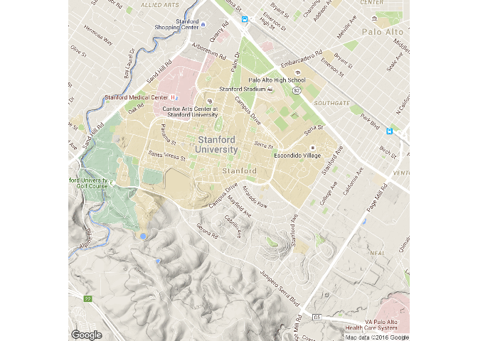
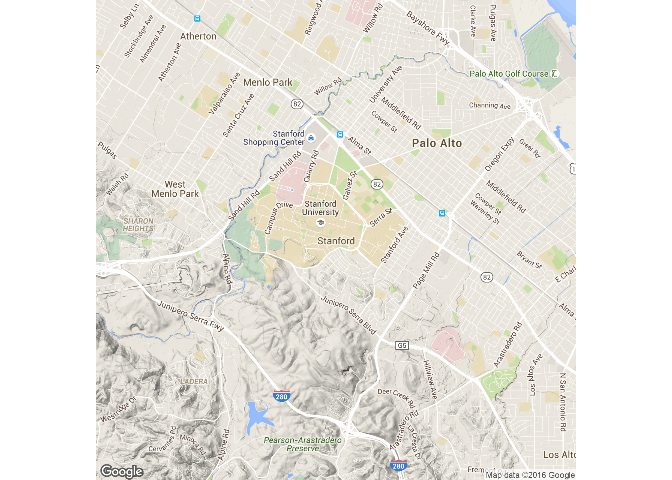
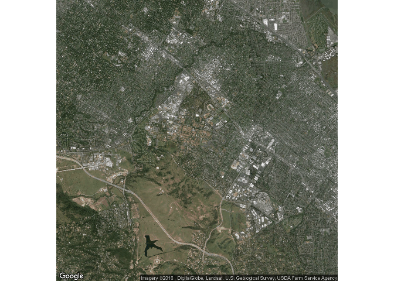
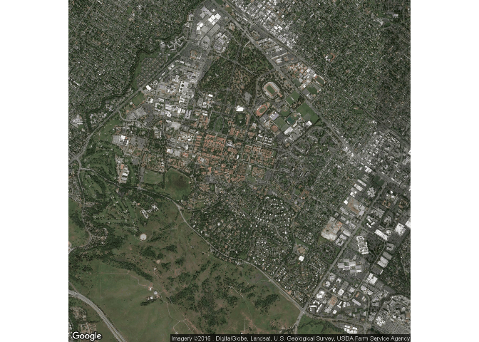
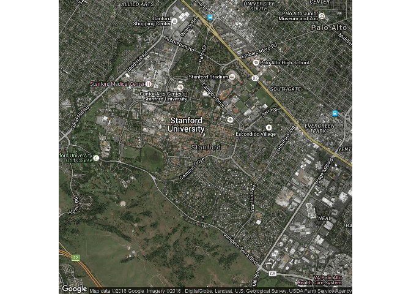
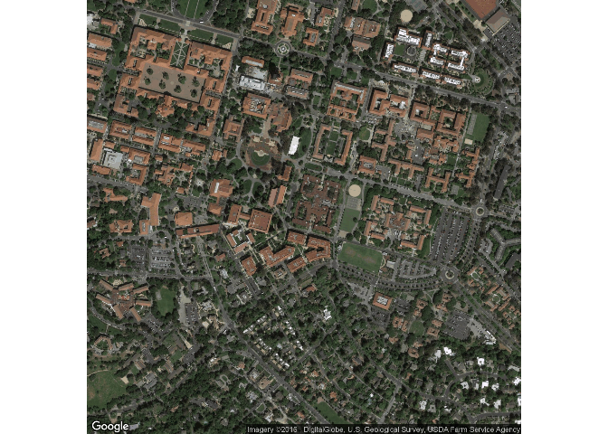
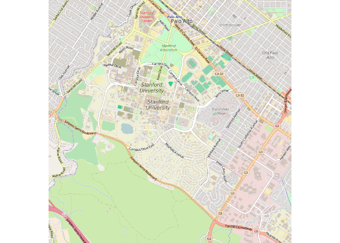
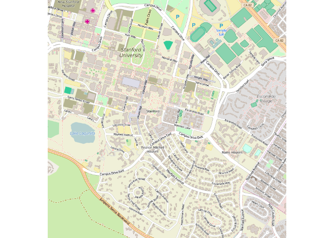

Stanford University
-------------------

    library("ggmap")

    ## Loading required package: ggplot2

    cityI <- "Stanford"
    cityM <- qmap(cityI,zoom=14)

    ## Map from URL : http://maps.googleapis.com/maps/api/staticmap?center=Stanford&zoom=14&size=640x640&scale=2&maptype=terrain&language=en-EN&sensor=false

    ## Information from URL : http://maps.googleapis.com/maps/api/geocode/json?address=Stanford&sensor=false

    cityM13 <- qmap(cityI,zoom=13)

    ## Map from URL : http://maps.googleapis.com/maps/api/staticmap?center=Stanford&zoom=13&size=640x640&scale=2&maptype=terrain&language=en-EN&sensor=false
    ## Information from URL : http://maps.googleapis.com/maps/api/geocode/json?address=Stanford&sensor=false

    cityM

    cityM13

    cityS13 <- qmap(cityI,zoom=13, maptype = "satellite")

    ## Map from URL : http://maps.googleapis.com/maps/api/staticmap?center=Stanford&zoom=13&size=640x640&scale=2&maptype=satellite&language=en-EN&sensor=false

    ## Information from URL : http://maps.googleapis.com/maps/api/geocode/json?address=Stanford&sensor=false

    cityS13

    cityS14 <- qmap(cityI,zoom=14, maptype = "satellite")

    ## Map from URL : http://maps.googleapis.com/maps/api/staticmap?center=Stanford&zoom=14&size=640x640&scale=2&maptype=satellite&language=en-EN&sensor=false
    ## Information from URL : http://maps.googleapis.com/maps/api/geocode/json?address=Stanford&sensor=false

    cityS14

    cityH14 <- qmap(cityI,zoom=14, maptype = "hybrid")

    ## Map from URL : http://maps.googleapis.com/maps/api/staticmap?center=Stanford&zoom=14&size=640x640&scale=2&maptype=hybrid&language=en-EN&sensor=false
    ## Information from URL : http://maps.googleapis.com/maps/api/geocode/json?address=Stanford&sensor=false

    cityH14

    cityS16 <- qmap(cityI,zoom=16, maptype = "satellite")

    ## Map from URL : http://maps.googleapis.com/maps/api/staticmap?center=Stanford&zoom=16&size=640x640&scale=2&maptype=satellite&language=en-EN&sensor=false

    ## Information from URL : http://maps.googleapis.com/maps/api/geocode/json?address=Stanford&sensor=false

    cityS16

    ccenter <- "Stanford"
    ccenterH14 <- qmap(ccenter,zoom=14, maptype = "hybrid")

    ## Map from URL : http://maps.googleapis.com/maps/api/staticmap?center=Stanford&zoom=14&size=640x640&scale=2&maptype=hybrid&language=en-EN&sensor=false

    ## Information from URL : http://maps.googleapis.com/maps/api/geocode/json?address=Stanford&sensor=false

    ccenterH14

    ccenterO14 <- qmap(ccenter,zoom=14, source = "osm")

    ## Map from URL : http://maps.googleapis.com/maps/api/staticmap?center=Stanford&zoom=14&size=640x640&scale=2&maptype=terrain&sensor=false

    ## Information from URL : http://maps.googleapis.com/maps/api/geocode/json?address=Stanford&sensor=false

    ccenterO14

    ccenterO15 <- qmap(ccenter,zoom=15, source = "osm")

    ## Map from URL : http://maps.googleapis.com/maps/api/staticmap?center=Stanford&zoom=15&size=640x640&scale=2&maptype=terrain&sensor=false

    ## Information from URL : http://maps.googleapis.com/maps/api/geocode/json?address=Stanford&sensor=false

    ccenterO15

