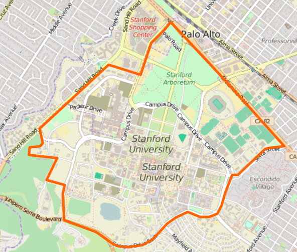

&lt;&lt;&lt;&lt;&lt;&lt;&lt; HEAD
=================================

GESIS
-----

Leibniz Institute for the Social Sciences

-   [Research:](http://www.gesis.org/en/services/research/) Information
    on data, literature, research projects, important institutions and
    conferences
-   [Study planning:](http://www.gesis.org/en/services/study-planning/)
    Consultation and services for planning and conducting a survey
-   [Data
    collection:](http://www.gesis.org/en/services/data-collection/)
    Consultation and services during the data collection phase
-   [Data analysis:](http://www.gesis.org/en/services/data-analysis/)
    Support, consultation and data for secondary analysis and reference,
    analyzing tools
-   [Archiving and
    registering:](http://www.gesis.org/en/services/archiving-and-registering/)
    Longterm permanent archiving and registration of data and
    publications

Openstreetmap
-------------

> > > > > > > origin/master

    library("ggmap")

    ## Loading required package: ggplot2

    cityI <- "Stanford"
    cityM <- qmap(cityI,zoom=14)

    ## Map from URL : http://maps.googleapis.com/maps/api/staticmap?center=Stanford&zoom=14&size=640x640&scale=2&maptype=terrain&language=en-EN&sensor=false

    ## Information from URL : http://maps.googleapis.com/maps/api/geocode/json?address=Stanford&sensor=false

    cityM13 <- qmap(cityI,zoom=13)

    ## Map from URL : http://maps.googleapis.com/maps/api/staticmap?center=Stanford&zoom=13&size=640x640&scale=2&maptype=terrain&language=en-EN&sensor=false
    ## Information from URL : http://maps.googleapis.com/maps/api/geocode/json?address=Stanford&sensor=false

    cityM

    cityM13

    cityS13 <- qmap(cityI,zoom=13, maptype = "satellite")

    ## Map from URL : http://maps.googleapis.com/maps/api/staticmap?center=Stanford&zoom=13&size=640x640&scale=2&maptype=satellite&language=en-EN&sensor=false

    ## Information from URL : http://maps.googleapis.com/maps/api/geocode/json?address=Stanford&sensor=false

    cityS13

    cityS14 <- qmap(cityI,zoom=14, maptype = "satellite")

    ## Map from URL : http://maps.googleapis.com/maps/api/staticmap?center=Stanford&zoom=14&size=640x640&scale=2&maptype=satellite&language=en-EN&sensor=false
    ## Information from URL : http://maps.googleapis.com/maps/api/geocode/json?address=Stanford&sensor=false

    cityS14

    cityH14 <- qmap(cityI,zoom=14, maptype = "hybrid")

    ## Map from URL : http://maps.googleapis.com/maps/api/staticmap?center=Stanford&zoom=14&size=640x640&scale=2&maptype=hybrid&language=en-EN&sensor=false
    ## Information from URL : http://maps.googleapis.com/maps/api/geocode/json?address=Stanford&sensor=false

    cityH14

    cityS16 <- qmap(cityI,zoom=16, maptype = "satellite")

    ## Map from URL : http://maps.googleapis.com/maps/api/staticmap?center=Stanford&zoom=16&size=640x640&scale=2&maptype=satellite&language=en-EN&sensor=false

    ## Information from URL : http://maps.googleapis.com/maps/api/geocode/json?address=Stanford&sensor=false

    cityS16

    ccenter <- "Stanford"
    ccenterH14 <- qmap(ccenter,zoom=14, maptype = "hybrid")

    ## Map from URL : http://maps.googleapis.com/maps/api/staticmap?center=Stanford&zoom=14&size=640x640&scale=2&maptype=hybrid&language=en-EN&sensor=false

    ## Information from URL : http://maps.googleapis.com/maps/api/geocode/json?address=Stanford&sensor=false

    ccenterH14

    ccenterO14 <- qmap(ccenter,zoom=14, source = "osm")

    ## Map from URL : http://maps.googleapis.com/maps/api/staticmap?center=Stanford&zoom=14&size=640x640&scale=2&maptype=terrain&sensor=false

    ## Information from URL : http://maps.googleapis.com/maps/api/geocode/json?address=Stanford&sensor=false

    ccenterO14

    ccenterO15 <- qmap(ccenter,zoom=15, source = "osm")

    ## Map from URL : http://maps.googleapis.com/maps/api/staticmap?center=Stanford&zoom=15&size=640x640&scale=2&maptype=terrain&sensor=false

    ## Information from URL : http://maps.googleapis.com/maps/api/geocode/json?address=Stanford&sensor=false

    ccenterO15

