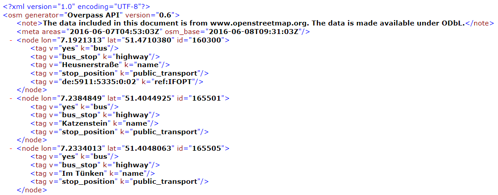

```{r setup, include=FALSE}
knitr::opts_chunk$set(echo = TRUE)
```

## The Openstreetmap project


## Get the data

[Data can be downloaded ](http://wiki.openstreetmap.org/wiki/Downloading_data):

- [Country and area extracts](http://wiki.openstreetmap.org/wiki/Planet.osm#Country_and_area_extracts)

- With [XAPI](http://wiki.openstreetmap.org/wiki/Xapi) and [Overpass API](http://wiki.openstreetmap.org/wiki/Overpass_API) it is possible to download custom data sets

## XML from Overpass

