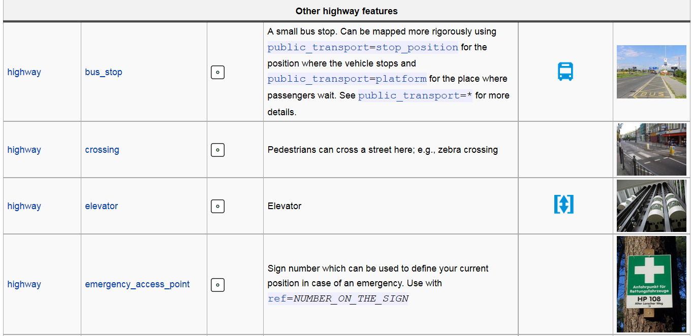
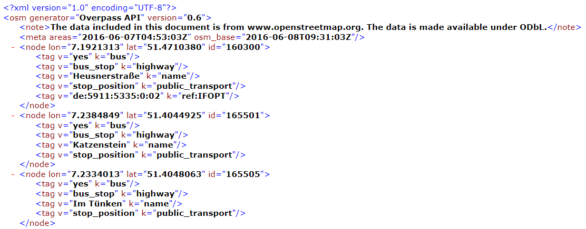

# Openstreetmap
Jan-Philipp Kolb  
8 Juni 2016  

## The Openstreetmap project

## Get the data

[Data can be downloaded ](http://wiki.openstreetmap.org/wiki/Downloading_data):

- [Country and area extracts](http://wiki.openstreetmap.org/wiki/Planet.osm#Country_and_area_extracts)

- With [XAPI](http://wiki.openstreetmap.org/wiki/Xapi) and [Overpass API](http://wiki.openstreetmap.org/wiki/Overpass_API) it is possible to download custom data sets

- [Databases](http://wiki.openstreetmap.org/wiki/Databases_and_data_access_APIs)

## XML from Overpass

## [Openstreetmap](www.openstreetmap.org)

- free project

- [User-Generated
street Maps](http://discovery.ucl.ac.uk/13849/1/13849.pdf)
