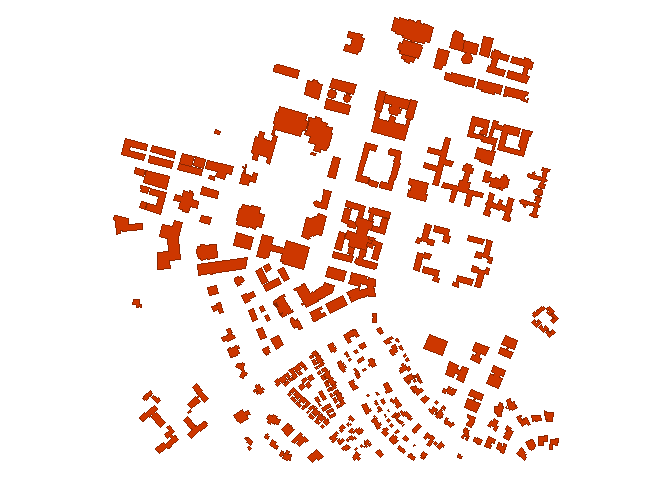
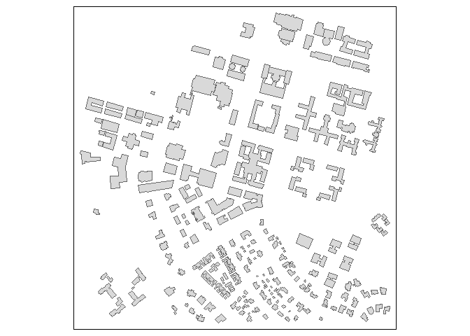
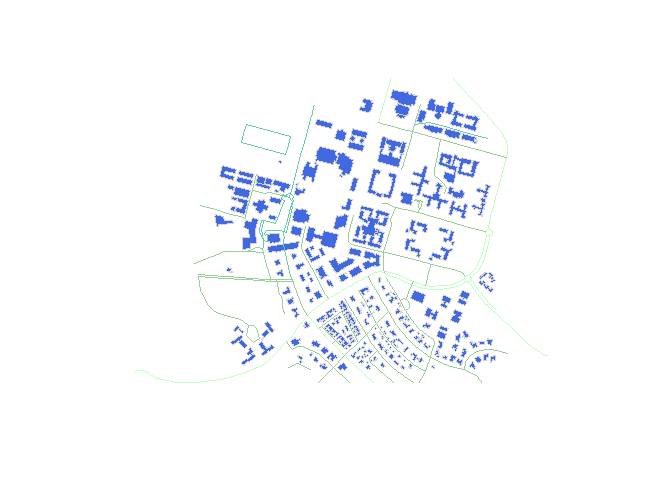
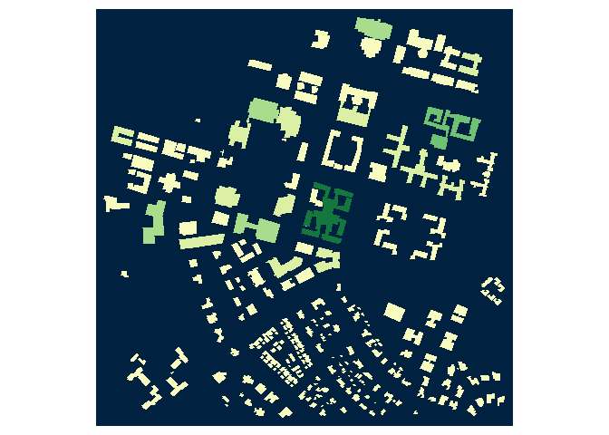

Get the contours of buildings
-----------------------------

    ## png 
    ##   2

    ## png 
    ##   2

Plot the roads
--------------

Links
-----

-   [tmap in a
    nutshell](https://cran.r-project.org/web/packages/tmap/vignettes/tmap-nutshell.html)

-   [Compute the area of
    shapes](https://stat.ethz.ch/pipermail/r-sig-geo/2011-January/010789.html)
